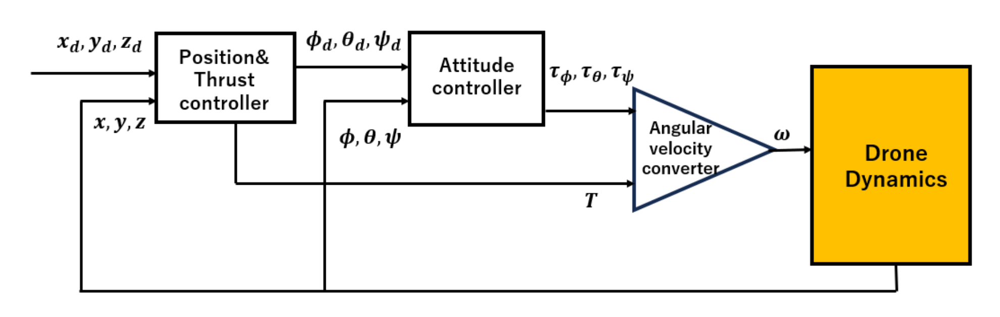
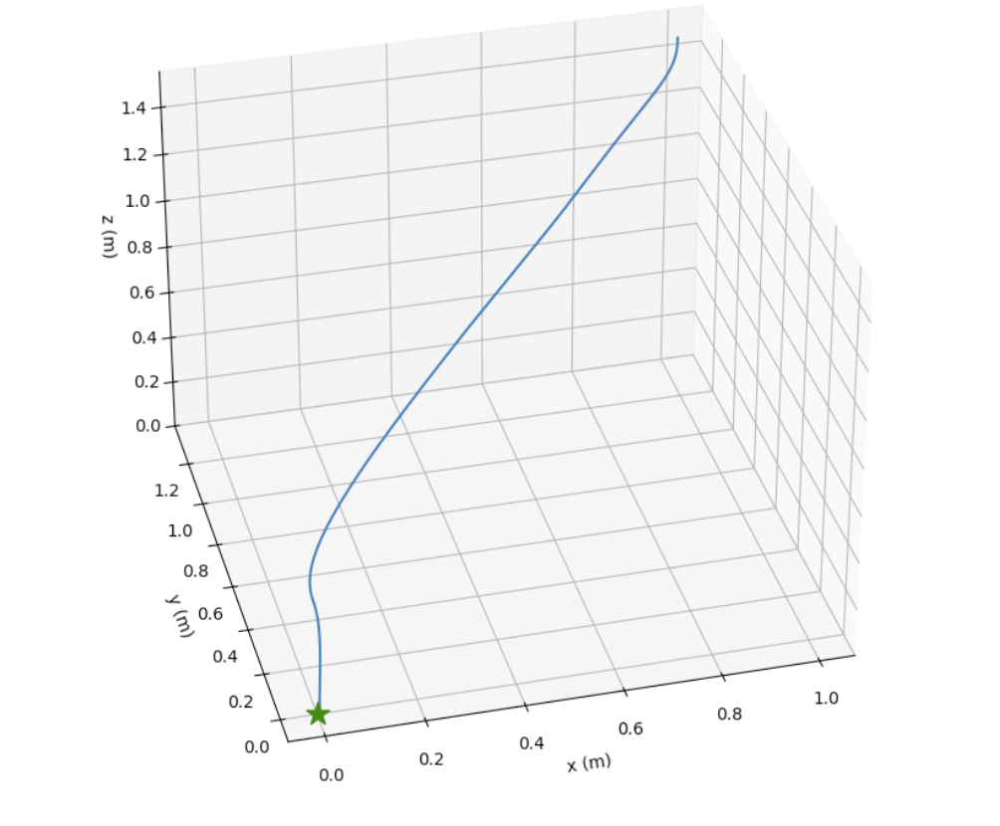
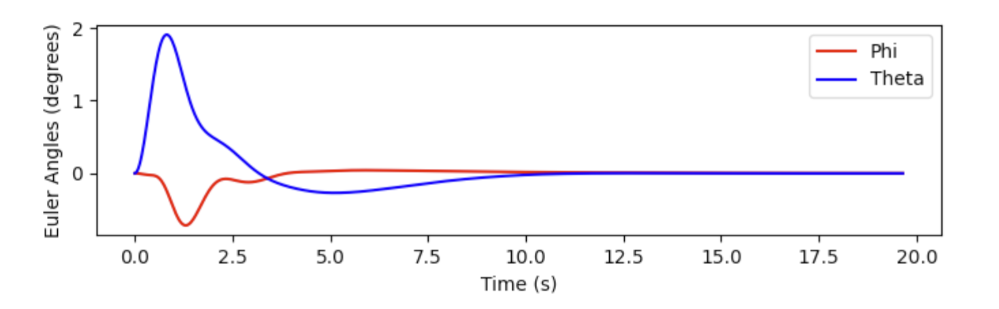
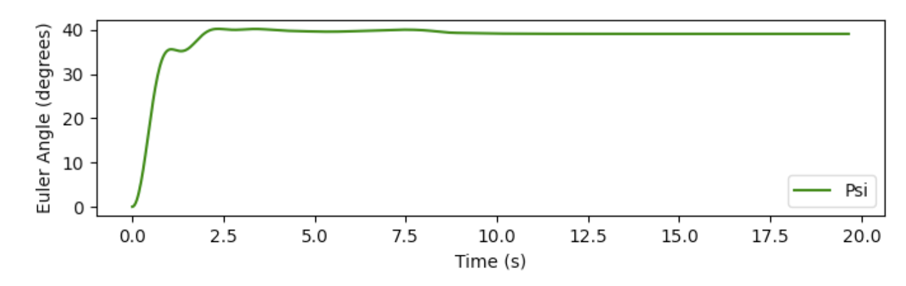

This is autonomous drone landing simulation. Here is the block diagram for simple drone simulation.

Fig1. Block diagram for drone control

### Run
Recommend to use  [uv](https://docs.astral.sh/uv/#getting-started).
```
$ uv sync
$ source ./venv/bin/activate
$ python3 simu.py
```

### Result
Here is the landing result from the initial position (x, y, z) = (1.0, 1.3, 1.5) m to the target at (0, 0, 0) m.


Fig2. Trajectory from (1.0, 1.3, 1.5) to (0, 0, 0) (m)



Fig 3.1. Time-series plot of roll and pitch angles

Fig 3.2. Time-series plot of yaw angles


